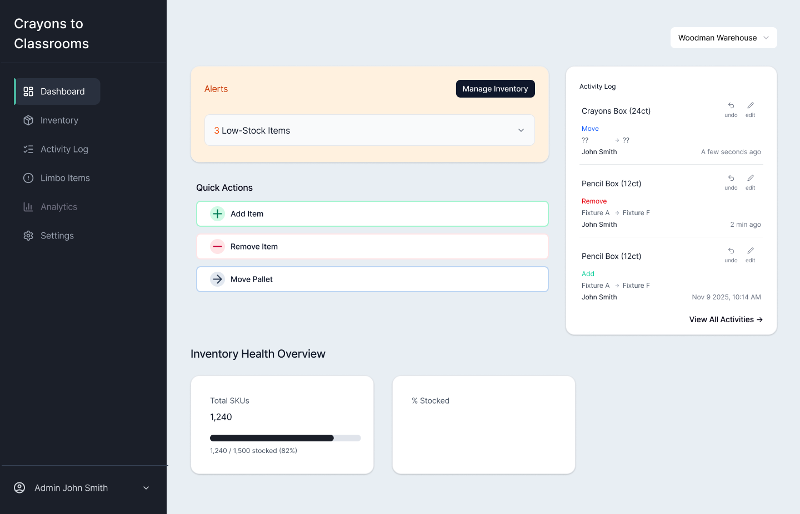
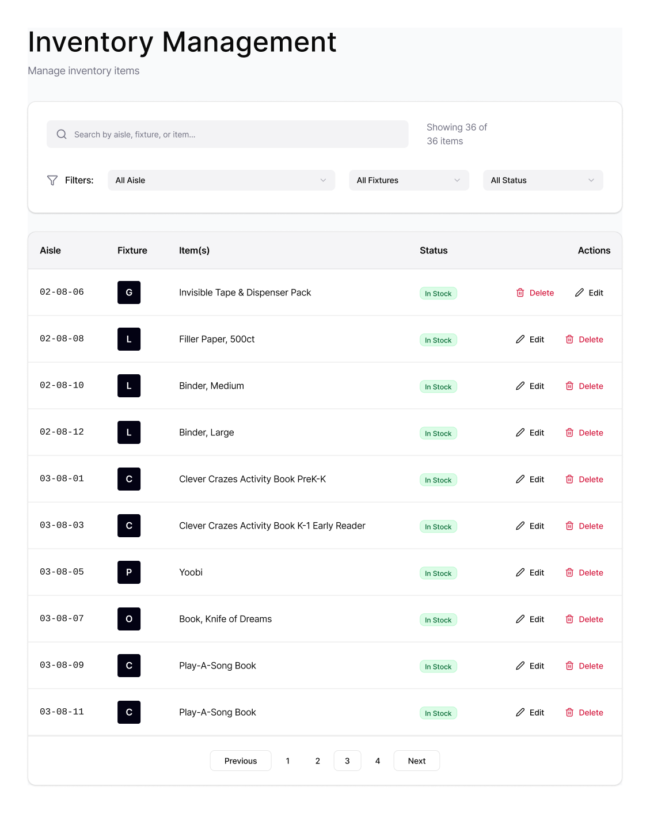
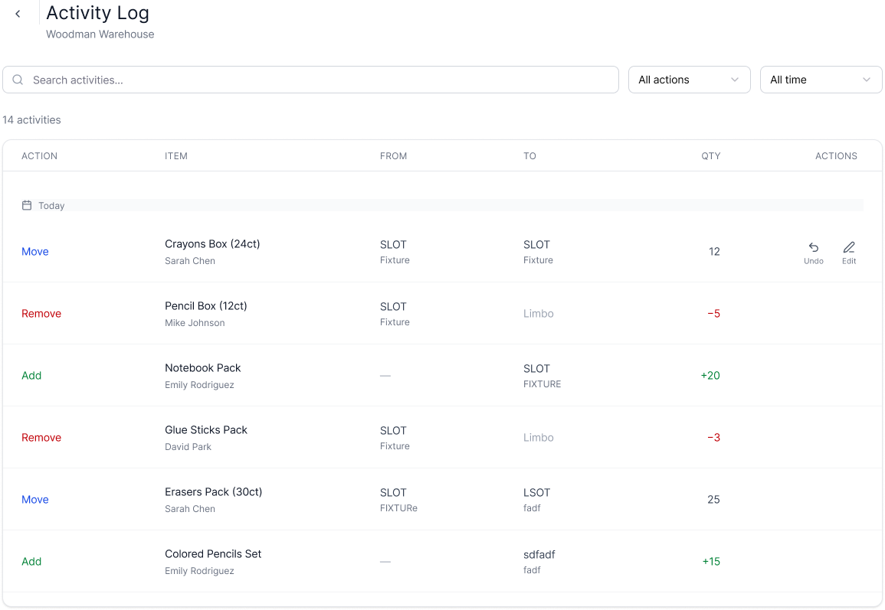

# crayons-to-classrooms-portfolio
# Crayons to Classrooms — Inventory System (Design & Architecture Portfolio)

This repository contains **non-proprietary design artifacts** (UI screens, workflows, and system diagrams) from my work on an inventory/workflow system for a nonprofit warehouse context.

**Code is proprietary and not included**. This repo focuses on documentation that is implementation-ready: flows, data model thinking, and API-level specification.

---

## What’s inside

- `design/` — UI screens exported from Figma
- `architecture/` — Workflow + system diagrams (inventory lifecycle, roles, data model visuals)
- `api-contract/` — Draft API contracts (no code)
- `decisions/` — Key decisions, tradeoffs, and next steps

---

## UI Screens

### Dashboard

### Inventory Table

### Item Activity

---

## Implementation Spec (High Level)

Even though production code is private, the system was designed around standard patterns:

- Inventory listing + search + filtering
- Item-level history / audit trail
- Role-based access controls (view vs edit)

See: `api-contract/` and `decisions/`.
